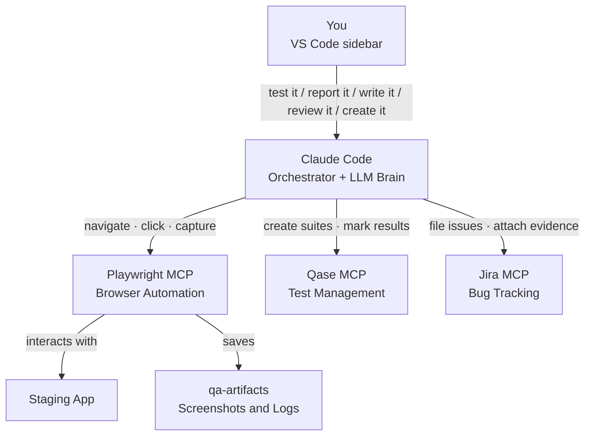

# Senior QA Engineer Agent

An autonomous QA agent that runs inside VS Code. Give it a staging URL and your requirements — in any form: plain-text description, a Jira ticket, acceptance criteria, a PRD, a Figma link, or a screenshot — and it writes test cases, executes them in a real browser, finds bugs, files detailed Jira issues, and creates your QA sprint tickets, all without you lifting a finger. Every test case it writes is saved to Qase.

> Built with Claude Code · Playwright MCP · Qase · Jira

---

## Contents

- [What It Does](#what-it-does)
- [Five Modes](#five-modes)
- [Architecture](#architecture)
- [Knowledge Base](#knowledge-base)
- [Tech Stack](#tech-stack)
- [Project Structure](#project-structure)
- [Setup](#setup) ← **start here**
- [Usage](#usage)
- [Example Output](#example-output)
- [Skills](#skills)
- [Roadmap](#roadmap)
- [Troubleshooting](#troubleshooting)
- [License](#license)

---

## What It Does

```
You: "test it — App: https://staging.myapp.com — <your requirements>"

      where <your requirements> is any of:
        Feature: User Login
        Jira: PROJ-42
        Figma: https://figma.com/file/abc123/Login-Flow

Agent:
  1. Reads your requirements (or fetches them from Jira)
  2. Writes test cases → uploads to Qase
  3. Opens a real browser → executes every test
  4. Finds bugs → captures screenshot + console + network logs
  5. Files detailed bug reports to Jira
  6. Closes the session with a full summary
```

Runs entirely inside VS Code. No extra tools, no dashboards, no context-switching.

---

## Five Modes

| Mode | Trigger | What Happens |
|------|---------|-------------|
| **WAY 1** — Full QA Session | `test it` | Full lifecycle: analyze → write test cases → execute → file bugs → summary |
| **WAY 2** — Quick Bug Report | `report it` | Parse your shorthand input → format → file to Jira instantly |
| **WAY 3** — Write Test Cases | `write it` | Analyze requirements → generate test cases → upload to Qase |
| **WAY 4** — Review Test Cases | `review it` | Audit & improve existing Qase suite → fix fields → fill gaps |
| **WAY 5** — Create QA Jira Tickets | `create it` | Fetch epic → create TC Dev ticket + Retesting parent + sub-tasks → move to backlog |

---

## Architecture


```mermaid
flowchart TD
    User[You\nVS Code sidebar]
    CC[Claude Code\nOrchestrator + LLM Brain]
    PW[Playwright MCP\nBrowser Automation]
    QA[Qase MCP\nTest Management]
    JR[Jira MCP\nBug Tracking]
    APP[Staging App]
    FS[qa-artifacts\nScreenshots and Logs]

    User -->|"test it / report it / write it / review it / create it"| CC
    CC -->|"navigate · click · capture"| PW
    CC -->|"create suites · mark results"| QA
    CC -->|"file issues · attach evidence"| JR
    PW -->|"interacts with"| APP
    PW -->|"saves"| FS
```

---

## Knowledge Base

*The agent's product memory.*

By default an AI test agent starts every session cold — it only knows the requirements and staging URL you give it. The `knowledge-base/` folder fixes that. It's persistent product memory the agent loads automatically before analyzing requirements (WAY 1, 3, 4), keyed by your **Qase project code** (`QASE_PROJECT` in settings).

### Per-feature file structure

Knowledge files are named `<feature>-<type>.md` and live flat in the product folder. Each feature gets its own set of files — there is no single shared file per type:

```
knowledge-base/
├── _TEMPLATE/                          ← example files showing the naming convention
│   ├── example-feature-business-rules.md
│   ├── example-feature-feature-map.md
│   ├── example-feature-known-defects.md
│   └── example-feature-product-flows.md
└── <QASE_PROJECT>/                     ← your product's KB (keyed by Qase project code)
    ├── document-upload-business-rules.md
    ├── document-upload-known-defects.md
    ├── auth-product-flows.md
    ├── auth-business-rules.md
    └── ...
```

Create your first feature KB file:

```bash
mkdir -p knowledge-base/MYPROJECT
cp knowledge-base/_TEMPLATE/example-feature-business-rules.md knowledge-base/MYPROJECT/my-feature-business-rules.md
# rename and fill in your real rules
```

| File type | What it changes |
|-----------|-----------------|
| `<feature>-product-flows.md` | Grounds happy-path tests in real navigation, not guesses |
| `<feature>-business-rules.md` | **Bug-vs-intended oracle** — a rule here outranks heuristic guesses |
| `<feature>-feature-map.md` | Adds regression-risk areas to every test scope |
| `<feature>-known-defects.md` | Probes weak spots harder; prevents duplicate bug reports |

**It compounds.** At the end of every WAY 1 session the agent proposes KB updates — new confirmed defects, flows, rules learned. You can also just tell it a fact ("the upload limit is now 20 MB") and it files it into the right KB file. See [knowledge-base/GUIDE.md](knowledge-base/GUIDE.md) for the full format.

---

## Tech Stack

| Tool | Role | Cost |
|------|------|------|
| [VS Code](https://code.visualstudio.com) + [Claude Code Extension](https://marketplace.visualstudio.com/items?itemName=Anthropic.claude-code) | IDE + agent orchestrator | Free + $20/mo (Claude Pro) |
| Claude Sonnet (Anthropic) | LLM brain — reasoning, test generation, bug analysis | Included with Claude Pro |
| [Playwright MCP](https://github.com/microsoft/playwright-mcp) | Browser automation, screenshots, logs | Free |
| [Qase MCP](https://github.com/qase-tms/qase-mcp-server) | Upload test cases, manage runs, mark results | Free tier available |
| [mcp-atlassian](https://github.com/Vijay-Duke/mcp-atlassian) | File Jira issues, create tickets | Free |

**Estimated total: ~$20/month** (Claude Pro covers everything)

---

## Project Structure

```
qa-agent/
├── CLAUDE.md                          # Agent brain — full workflow + trigger keywords
├── README.md                          # This file
├── playwright.config.js               # Playwright test runner config
├── tsconfig.json                      # TypeScript config (for scripts)
├── package.json                       # MCP server dependencies + TypeScript dev deps
├── knowledge-base/                    # Persistent product memory (per-feature files)
│   ├── GUIDE.md                       # How the knowledge base works
│   └── _TEMPLATE/                     # Example files — model your KB files on these
│       ├── example-feature-business-rules.md
│       ├── example-feature-feature-map.md
│       ├── example-feature-known-defects.md
│       └── example-feature-product-flows.md
├── fixtures/
│   └── test-files/                    # Ready-to-use valid & invalid files for upload tests
│       ├── valid.pdf, valid.jpg, valid.docx, valid.xlsx …
│       └── invalid.exe, invalid.zip, invalid.mp4 …
├── scripts/
│   └── lib/
│       └── make-pdf.ts                # Utility: generate synthetic PDFs of a target size
├── .mcp.json                          # MCP server config with API tokens (gitignored)
├── .claude/
│   ├── settings.json                  # Claude Code settings + env tokens (gitignored)
│   └── agents/                        # 10 specialist skills
│       ├── requirements-analyzer/
│       ├── acceptance-criteria-parser/
│       ├── test-case-writer/
│       ├── edge-case-generator/
│       ├── playwright-navigator/
│       ├── exploratory-tester/
│       ├── issue-reporter/
│       ├── severity-classifier/
│       ├── test-case-reviewer/
│       └── test-session-reporter/
├── qa-artifacts/                      # Created locally — gitignored
│   ├── <QASE_PROJECT>/
│   │   └── screenshots/
│   └── logs/
└── assets/                            # README images
```

Files excluded from git: `.mcp.json`, `.claude/settings.json`, `qa-artifacts/`

---

## Setup

### 1. Prerequisites

| Requirement | Version | Install |
|-------------|---------|---------|
| VS Code | Latest | [code.visualstudio.com](https://code.visualstudio.com) |
| Claude Code Extension | Latest | VS Code Extensions → search "Claude Code" |
| Node.js | 18+ | [nodejs.org](https://nodejs.org) |
| Claude Pro account | — | Required for Claude Code |

### 2. Clone the repo

```bash
git clone https://github.com/your-username/qa-agent.git
cd qa-agent
```

### 3. Install dependencies

```bash
npm install
```

This installs all three MCP servers locally (`@playwright/mcp`, `@qase/mcp-server`, `mcp-atlassian`) plus TypeScript tooling. The `.mcp.json` config runs MCP servers from `node_modules/` — no global installs or `npx` needed.

### 4. Install Playwright browser

```bash
npx playwright install chromium
```

### 5. Get your API tokens

| Service | Where to get it |
|---------|----------------|
| **Jira** | [id.atlassian.com](https://id.atlassian.com) → Security → API Tokens → Create |
| **Qase** | [app.qase.io](https://app.qase.io) → Settings → API Tokens → Generate |

You also need:
- Your **Jira workspace URL** (e.g. `https://yourcompany.atlassian.net`)
- Your **Jira project key** (e.g. `SCRUM`)
- Your **Qase project code** (e.g. `DEMO`)

### 6. Create your config files

**`.mcp.json`** — create this file in the project root:

```json
{
  "mcpServers": {
    "playwright": {
      "type": "stdio",
      "command": "node",
      "args": ["node_modules/@playwright/mcp/cli.js", "--headless"]
    },
    "qase": {
      "type": "stdio",
      "command": "node",
      "args": ["node_modules/@qase/mcp-server/build/index.js"],
      "env": { "QASE_API_TOKEN": "your_qase_token" }
    },
    "jira": {
      "type": "stdio",
      "command": "node",
      "args": ["node_modules/mcp-atlassian/dist/index.js"],
      "env": {
        "ATLASSIAN_BASE_URL": "https://yourcompany.atlassian.net",
        "ATLASSIAN_EMAIL": "your@email.com",
        "ATLASSIAN_API_TOKEN": "your_jira_api_token"
      }
    }
  }
}
```

> **Note:** This project uses [Vijay-Duke/mcp-atlassian](https://github.com/Vijay-Duke/mcp-atlassian) (Node.js, npm). The env vars are `ATLASSIAN_BASE_URL`, `ATLASSIAN_EMAIL`, and `ATLASSIAN_API_TOKEN` — not the `JIRA_URL` / `JIRA_USERNAME` / `JIRA_API_TOKEN` keys used by the unrelated [sooperset/mcp-atlassian](https://github.com/sooperset/mcp-atlassian) Python library.

**`.claude/settings.json`** — create this file:

```json
{
  "model": "claude-sonnet-4-6",
  "enableAllProjectMcpServers": true,
  "permissions": {
    "defaultMode": "bypassPermissions",
    "allow": ["Bash(*)", "Read(*)", "Write(*)", "Edit(*)", "mcp__playwright__*", "mcp__qase__*", "mcp__jira__*"]
  },
  "env": {
    "ATLASSIAN_BASE_URL": "https://yourcompany.atlassian.net",
    "JIRA_PROJECT": "SCRUM",
    "QASE_PROJECT": "DEMO",
    "SCREENSHOT_DIR": "./qa-artifacts/DEMO/screenshots",
    "LOG_DIR": "./qa-artifacts/logs"
  }
}
```

> **Why two files?** `.mcp.json` holds the full Atlassian and Qase credentials — these are read by the MCP server processes at startup. `settings.json` exposes only the non-secret env vars Claude needs at runtime (`JIRA_PROJECT`, `QASE_PROJECT`, `ATLASSIAN_BASE_URL` for link generation). Keep API tokens in `.mcp.json` only.

### 7. Create artifact directories

```bash
mkdir -p qa-artifacts/screenshots qa-artifacts/logs
```

### 8. Open in VS Code

```bash
code .
```

### 9. Verify MCP servers

Type `/mcp` in the Claude Code panel to confirm all three servers show as connected:
- `playwright` — browser automation
- `qase` — test case management
- `jira` — bug tracking

---

## Usage

### WAY 1 — Full QA Session

```
test it
App: https://staging.myapp.com
Feature: Document Upload
Requirements:
1. Users can upload PDF and DOCX files only
2. Files over 10MB are rejected with a clear error
3. Uploaded files appear in the document list immediately
```

Or from a Jira story:
```
test it
App: https://staging.myapp.com
Jira: PROJ-42
```

**Produces:** Qase test run with pass/fail results · Jira bug reports with screenshots + logs · Session report in `qa-artifacts/`

---

### WAY 2 — Quick Bug Report

```
report it
Admin Portal, Must be logged in, Go to Settings > Click Delete Account > Confirm > Observe: page shows 500 error instead of success message
```

Format: `[Portal], [Precondition], [Step 1 > Step 2 > Observe: what you saw]`

**Produces:** Jira bug filed instantly — summary printed with key, title, priority, and link.

---

### WAY 3 — Write Test Cases Only

```
write it
Jira: PROJ-42
App: https://staging.myapp.com/upload
```

Optional params: `App:` (UI-aware step wording) · `Figma:` (design reference)

**Produces:** Qase test cases organised into suites · Summary printed to terminal

---

### WAY 4 — Review Existing Test Cases

```
review it
Suite: https://app.qase.io/project/PROJ/suite/5
Jira: PROJ-42
```

**Fixes per test case:** Title format · Severity & Priority · Type → Regression · Layer → E2E · Behavior · Precondition · Steps · Expected Results · Test Data · Grammar

**Produces:** Updated Qase test cases · New cases for gaps · Review report printed to terminal

---

### WAY 5 — Create QA Jira Tickets from Epic

```
create it
Epic: PROJ-100
```

**Creates:** 1 TC Development ticket (aggregated requirements + Figma links) · 1 Retesting parent + 1 sub-task per dev story (all unassigned) · All moved to backlog

Story points calculated automatically from dev SP matrices.

---

## Example Output

### Bug Report Filed to Jira

```
[File Upload] 15MB file accepted despite 10MB limit

Precondition: Must have a property with file upload enabled

Steps To Reproduce:
1. Navigate to https://staging.myapp.com/documents
2. Click "Upload Document"
3. Select a 15MB PDF file
4. Click "Save"
5. Observe the system response.

---

Actual Result: File uploads successfully with no error shown.

---

Expected Result: Upload rejected with error: "File size exceeds the 10MB limit."

---

Test Data: https://staging.myapp.com/documents | File: 15MB PDF
```

---

## Skills

Each skill is a specialist instruction file in `.claude/agents/` that gives the agent expert-level knowledge for one phase of testing.

| Skill | Used In | What It Does |
|-------|---------|-------------|
| `requirements-analyzer` | WAY 1, 3, 4 | Breaks specs into happy paths, edge cases, security scenarios |
| `acceptance-criteria-parser` | WAY 1, 3 | Converts BDD / user-story criteria into pass/fail conditions |
| `test-case-writer` | WAY 1, 3 | Generates Qase test cases with steps, preconditions, expected results |
| `edge-case-generator` | WAY 1, 3 | Adds boundary values, injection payloads, encoding attacks |
| `playwright-navigator` | WAY 1, 4 | Executes tests in browser, manages waits, captures failures |
| `exploratory-tester` | WAY 1 | Structured exploratory testing with heuristics and attack patterns |
| `issue-reporter` | WAY 1, 2 | Files Jira bug reports — WAY 1 with evidence, WAY 2 from shorthand input |
| `severity-classifier` | WAY 1 | Severity × priority matrix with auto-escalation for security bugs |
| `test-case-reviewer` | WAY 4 | Audits Qase suite — fix every field, grammar, gaps; create missing cases |
| `test-session-reporter` | WAY 1 | Closes session, updates Qase results, generates stakeholder report |

---

## Fixtures

`fixtures/test-files/` contains ready-to-use files for upload and file-type boundary tests — no need to source them yourself:

| File | Use |
|------|-----|
| `valid.pdf`, `valid.jpg`, `valid.png`, `valid.jpeg` | Image and document happy paths |
| `valid.docx`, `valid.doc` | Word document upload tests |
| `valid.xlsx`, `valid.xls`, `valid.csv` | Spreadsheet upload tests |
| `invalid.exe`, `invalid.zip`, `invalid.mp4`, `invalid.svg`, `invalid.html`, `invalid.txt` | Rejected file type tests |

The agent references these automatically when executing file upload test cases via Playwright.

`scripts/lib/make-pdf.ts` generates a synthetic PDF of any target size — useful for boundary tests (e.g. exactly at the 10 MB limit).

---

## Roadmap

### Shipped
- ✅ **Persistent, per-feature Knowledge Base** — product flows, business rules, feature map, known defects — per-feature files auto-loaded by `QASE_PROJECT`
- ✅ **Compounding knowledge** — agent proposes KB updates at end of each WAY 1 session and learns facts on demand
- ✅ **Bug confidence tiers** — `Confirmed` (violates a documented business rule) vs `Suspected` (heuristic only)
- ✅ **Test fixtures** — ready-to-use valid/invalid files for upload boundary testing
- ✅ **TypeScript scripting** — `scripts/lib/` utilities for generating test data programmatically

### Planned
1. **Bug approval gate** — auto-file only `Confirmed` defects; hold `Suspected` ones for sign-off
2. **Expand ingested context** — accept OpenAPI/Swagger spec; actually read Figma frames; pull existing Qase cases to avoid regenerating duplicates
3. **Measurement & metrics** — session metrics block (cases created, pass/fail/blocked, run time); running `qa-artifacts/metrics.csv`
4. **Knowledge-base bulk backfill** — point at a Jira epic or closed bugs to harvest rules and defects into the KB in one pass

---

## Troubleshooting

| Problem | Fix |
|---------|-----|
| Jira MCP 401 error | Check `ATLASSIAN_BASE_URL`, `ATLASSIAN_EMAIL`, `ATLASSIAN_API_TOKEN` in `.mcp.json` |
| Qase MCP auth fails | Regenerate token in Qase → Settings → API Tokens |
| Agent goes off-task | Ensure `CLAUDE.md` is in the project root; reload VS Code window |
| Screenshots not saved | Check `qa-artifacts/<QASE_PROJECT>/screenshots/` exists and is writable |
| MCP server not connecting | Type `/mcp` in Claude Code panel to verify server status |

---

## License

MIT — use freely, attribution appreciated.
